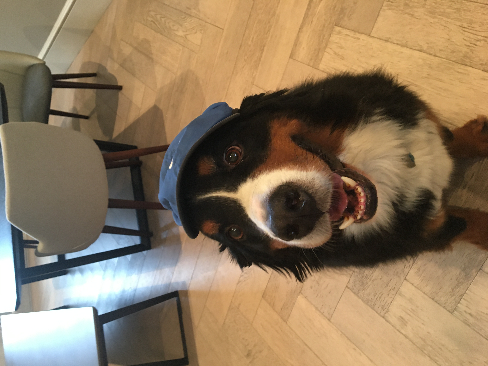

# Emily Young - HW01  
###### *Below I will practice using RMarkdown by writing a biography of myself*   
***
### An Introduction to Emily  
Hello and thank you for reading my introduction! My name is Emily Young and I 
am a 4^th^ year in the College double majoring in **Political Science** and **Public Policy** 
with a specialization in education policy. While I have always been interested in learning 
how to code, the process of actually doing so has seemed incredibly daunting. But, I'm taking
the leap and trying to learn now.

In terms of academic interests, I am really interested in the inequities present in our education 
system and how we can craft policies to remedy them.
After college, I hope to either become a teacher or work in the field of education 
policy. Because of this, I plan to take as many education
classes as I possibly can while I am here. 

But enough about academics, here's a little bit about me personally: 

1. I am from New York City and like most New Yorkers, I am very proud of this fact. 
However, when I moved to Chicago for college my parents decided to move to London, England.
While I'm definitely not a Londoner (a fact my 18 year old
brother loves rubbing in my face) I love visiting the city and my family during school breaks.  
2. For extracurricular activities:
    + I am a teacher's assistant for a 3^rd^ grade math class at a local Chicago Public School.
    + I help run a Model UN conference for high school students to teach them debate skills. 
  This year we are simulating the woman's suffrage movement and as an **avid** feminist 
  I can not wait to see how the kids tackle this challenge.  
    + I am a project leader for UChicago's student-run think tank, the Paul
  Douglas Institute.  
3. I can not drink coffee because I find the taste horrible. Instead I have a 
**very large** tea collection which I *love* sharing with friends. If you ever need 
recommendations on the best type of tea to drink (my answer is usually Earl Grey) 
or the best tea company (it's TWG or Williamsons), I am your girl. 
4. Despite my inability to dance, sing, or act, I really love musical theater
and frequently listen to Broadway cast recordings while studying. My friends unfortunately
are not avid fans of theater - so if you ever want to talk about musicals I would be 
*more than happy* to do so.
5. I have a giant dog named Bruder who lives with my parents in London.
He is big enough to fit into human-sized clothes and makes an excellent pillow/rug.

***

If you've read this entire biography I think you deserve a picture of Bruder so here you go:

